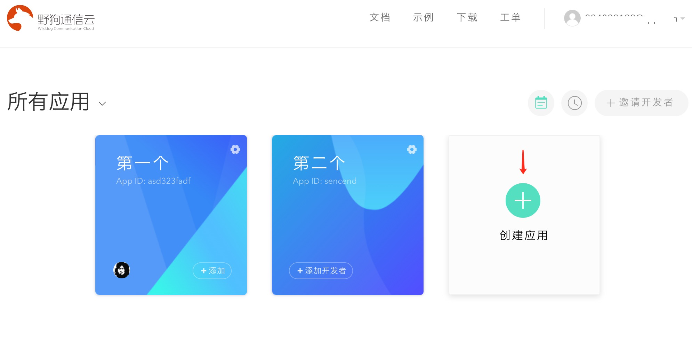
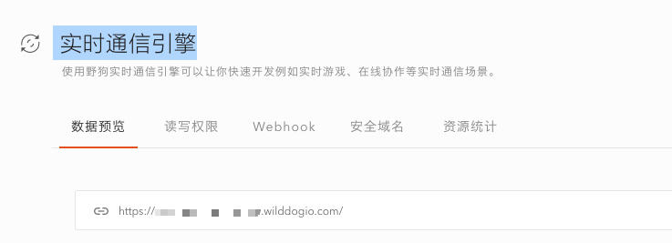
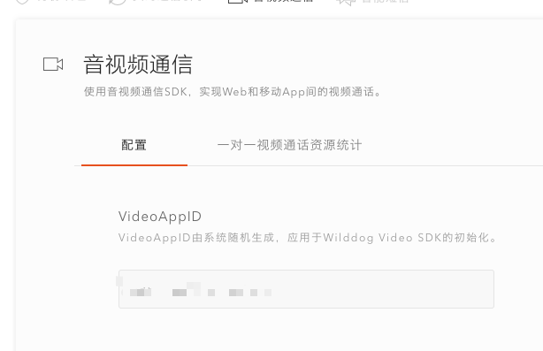

# video-demo-pc

`video-demo-pc` 是基于`wilddog-video-call SDK`,`wilddog-video-room SDK`,`wilddog SDK`,`electron`,`vuejs`开发的视频通话Demo，其中图片存储也使用了七牛的js sdk

## 准备环境

在项目的`src/config.js`文件里，运行项目前需要配置一些信息

```js
module.exports = {
  'wd': {
    syncAppId: "",
    videoAppid: ""
  },
  'qiniu': {
    BUCKET_NAME: "",
    ACCESS_KEY: "",
    SECRET_KEY: "",
    domain: ""
  }
};
```


### 必填信息

1.在`控制面板`中创建野狗应用



2.在 `身份认证` 标签页中，选择 `登录方式` 标签，开启 `匿名登录` 功能, 也可以选择其他的登录方式


3.在 `实时通信引擎` 标签页中获取`syncAppId`



4.在 `实时视频通话` 标签页中获取`videoAppid`




#### 可选配置

1.使用wilddog的在线互动白板功能时，如需要操作上传图片，则需要配置[七牛](https://developer.qiniu.com/)的信息


## 运行

``` bash
# 安装依赖
npm install

# 启动客户端
npm run dev

# 打包生成客户端,文件在dist目录下,windows下打包生成exe文件,mac下打包生成dmg文件
npm run build
```

## 支持

如果在使用过程中有任何问题，请提 [issue](https://github.com/WildDogTeam/video-demo-pc/issues) ，我会在 Github 上给予帮助。


